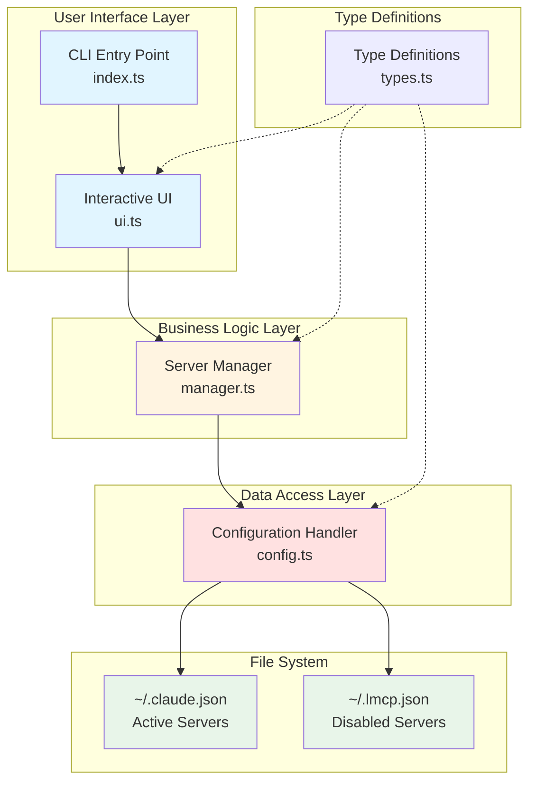
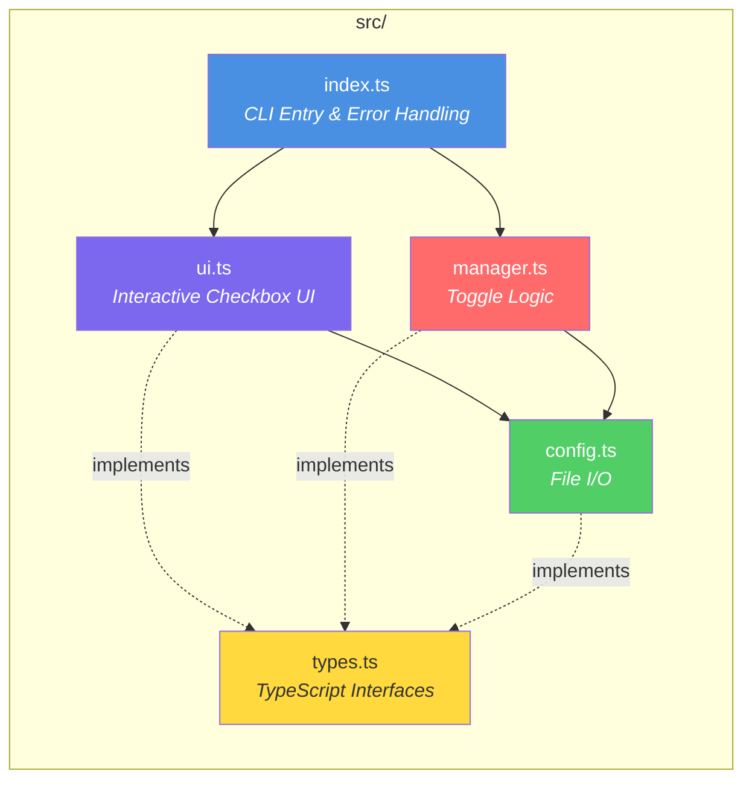
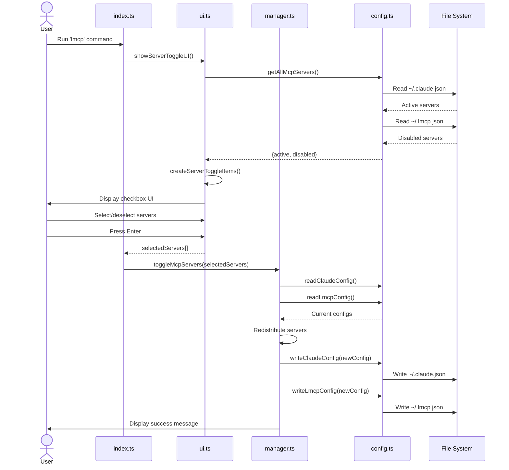
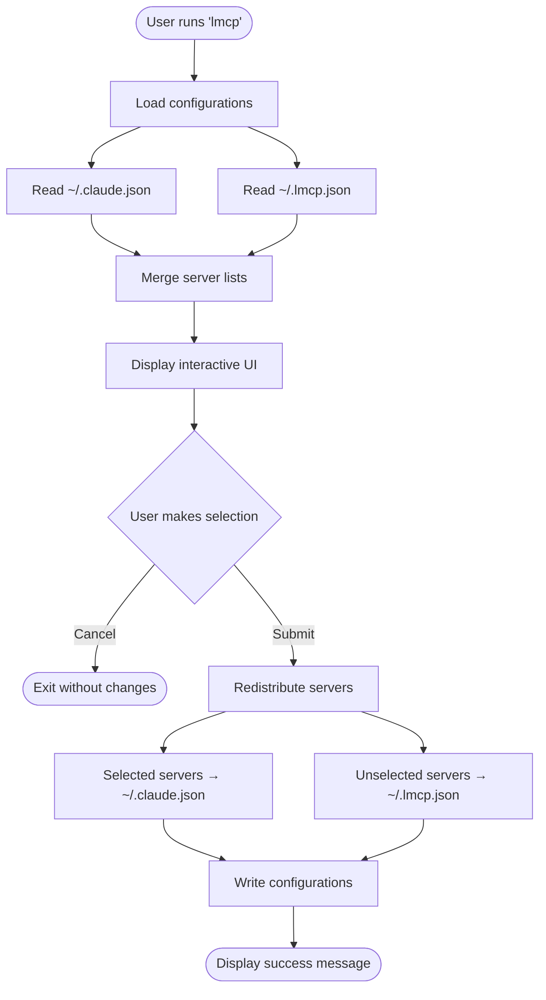

# Architecture Documentation

## System Overview

LMCP (Lightweight MCP Manager) is a CLI tool for managing Claude Desktop's MCP (Model Context Protocol) servers. It provides an interactive interface for toggling servers between active and disabled states while preserving their configurations.

## High-Level Architecture



## Component Diagram



## Sequence Diagram



## Data Flow



## Module Responsibilities

### 1. index.ts (CLI Entry Point)
**Purpose:** Application entry point and command-line interface setup

**Responsibilities:**
- Initialize Commander.js CLI program
- Handle global error catching and user cancellation
- Coordinate UI and manager components
- Provide version and help information

**Dependencies:**
- `commander` - CLI framework
- `chalk` - Terminal string styling
- Internal: `ui.ts`, `manager.ts`

### 2. ui.ts (Interactive User Interface)
**Purpose:** Render interactive checkbox interface for server selection

**Responsibilities:**
- Create formatted server toggle items with status indicators
- Display interactive checkbox UI using Inquirer
- Handle "no servers found" edge case
- Return user's server selection

**Dependencies:**
- `@inquirer/prompts` - Interactive CLI prompts
- `chalk` - Terminal colors and styling
- Internal: `config.ts`, `types.ts`

**Exports:**
- `createServerToggleItems(): ServerToggleItem[]`
- `showServerToggleUI(): Promise<string[]>`

### 3. manager.ts (Server Toggle Logic)
**Purpose:** Core business logic for toggling servers between active/disabled

**Responsibilities:**
- Redistribute servers based on user selection
- Move selected servers to active configuration
- Move unselected servers to disabled configuration
- Display status messages for each server
- Handle configuration write errors

**Dependencies:**
- `chalk` - Status message coloring
- Internal: `config.ts`

**Exports:**
- `toggleMcpServers(selectedServers: string[]): void`

### 4. config.ts (Configuration Management)
**Purpose:** Handle all file I/O operations for configuration files

**Responsibilities:**
- Read/write ~/.claude.json (active servers)
- Read/write ~/.lmcp.json (disabled servers)
- Aggregate servers from both sources
- Handle file existence checks
- Graceful error handling for I/O operations

**Dependencies:**
- Node.js `fs` module
- Node.js `os` module
- Node.js `path` module
- Internal: `types.ts`

**Exports:**
- `readClaudeConfig(): ClaudeConfig`
- `readLmcpConfig(): ClaudeConfig`
- `writeClaudeConfig(config: ClaudeConfig): void`
- `writeLmcpConfig(config: ClaudeConfig): void`
- `getAllMcpServers(): {active, disabled}`

### 5. types.ts (Type Definitions)
**Purpose:** Centralized TypeScript type definitions

**Exports:**
- `McpServer` - Server configuration structure
- `ClaudeConfig` - Claude Desktop config file structure
- `ServerToggleItem` - UI checkbox item structure

## Configuration File Structure

### ~/.claude.json (Active Servers)
```json
{
  "mcpServers": {
    "github": {
      "command": "npx",
      "args": ["-y", "@modelcontextprotocol/server-github"],
      "env": {
        "GITHUB_TOKEN": "ghp_xxxxx"
      }
    },
    "context7": {
      "command": "npx",
      "args": ["-y", "@context7/mcp-server"]
    }
  }
}
```

### ~/.lmcp.json (Disabled Servers)
```json
{
  "mcpServers": {
    "playwright": {
      "command": "npx",
      "args": ["-y", "@playwright/mcp-server"]
    },
    "postgres": {
      "command": "docker",
      "args": ["run", "postgres-mcp"]
    }
  }
}
```

## Technology Stack

| Component | Technology | Purpose |
|-----------|-----------|---------|
| Language | TypeScript 5.9+ | Type-safe development |
| CLI Framework | Commander 14.x | Command-line interface |
| Interactive Prompts | @inquirer/prompts 7.x | Checkbox UI |
| Terminal Styling | Chalk 5.x | Colored output |
| Build Tool | TypeScript Compiler | Compilation to JavaScript |
| Code Quality | Biome | Linting and formatting |
| Package Manager | pnpm | Dependency management |

## Design Patterns

### 1. Separation of Concerns
Each module has a single, well-defined responsibility:
- UI handles display only
- Manager handles business logic only
- Config handles I/O only

### 2. Dependency Injection
Functions receive dependencies as parameters rather than creating them internally:
```typescript
// config.ts provides data access functions
// manager.ts uses these functions without knowing implementation details
```

### 3. Error Boundary
Top-level error handling in `index.ts` catches and formats all errors:
```typescript
try {
  await showServerToggleUI();
} catch (error) {
  // Handle user cancellation vs. actual errors
}
```

## Security Considerations

1. **File System Access**
   - Only reads/writes to specific home directory files
   - No arbitrary file access
   - Validates file existence before reading

2. **Input Validation**
   - User can only select from existing servers
   - No arbitrary input accepted
   - Server names validated against known configurations

3. **Configuration Preservation**
   - Servers are moved, never deleted
   - Atomic write operations (write entire file at once)
   - Original configurations preserved in backup file

## Performance Characteristics

- **Startup Time:** < 100ms (depends on config file size)
- **Memory Usage:** Minimal (~20MB for Node.js + dependencies)
- **File I/O:** Synchronous operations (configs are small, < 10KB typically)
- **UI Rendering:** Instant for typical use cases (< 20 servers)

## Future Enhancements

Potential architectural improvements:

1. **Async File Operations**
   - Use async fs operations for better performance with large configs

2. **Configuration Validation**
   - JSON schema validation for server configurations
   - Warn about invalid server definitions

3. **Backup System**
   - Create timestamped backups before modifications
   - Allow rollback to previous configurations

4. **Multi-Profile Support**
   - Save and load different server profiles
   - Quick switching between work/personal setups

5. **Server Status Checking**
   - Test if servers are actually running
   - Validate server commands exist on system
